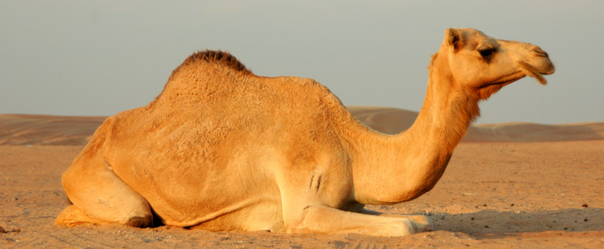

# Camel Facts

Camels are members of the family camelid which includes not only the dromedary and bactrian camels, but the "new world camels" which are the South American llama, alpaca, vicuna, and guanaco.
The "old world camels" are the dromedary and the bactrian, the only two members of the genus camelus or "True Camels".
The dromedary has one hump, the bactrian has two. The simplest way to remember this is to imagine the first letter of those names capitalized and lying on their flat end. A capital "D" - a capitol "B" - one hump or two!.
The bactrian camel is native to Asia and can be found on the border of Mongolia and China. Its range encompasses both desert and - surprisingly- snowy mountain ranges.
The bactrian camel has been domesticated for over 5000 years and only about 1000 to 2000 individuals still exist in the wild. 
The dromedary camel has been extinct in the wild for several hundred years. There are no wild herds in existence in the native lands of the Middle East and Asia where they first came to be, but some escaped domestic animals roam Australia.
It is estimated that the dromedary camel has been domesticated for perhaps 6000 years and has shaped the civilization of the entire world.
Camels are very specialized animals. Their famous humps are stores not of water, but of fat (which, like all body tissue is largely water) and can sustain them without water for as long as a month in the harshest desert conditions. In an environment where most of the creatures are very small, do to such limited resources and the danger of exposure, the camel is a virtual giant, reaching well over 5 ft at the top of the head and weighing nearly 800 pounds.
They maintain themselves in conditions that would kill nearly any other creature, with specialized expanding feet, nostrils they can open and close independently, lips that can chew thorns and even specially shaped blood cells.
The red blood cells of camels are are not circular but oval shaped - unlike any other mammal on earth. The theory is that the oval shape allows blood to continue to circulate even if it is thickened from lack of hydration.
When resources are scarce and a camel is living off the fat of its hump, the hump slowly deflates, and may even flop over, particularly in the bactrians, as the contents are depleted. And when a thirsty camel finally arrives at a water source it can easily drink up to 40 gallons in a matter of minutes.
The flesh of the hump can be seen to visibly re inflate and even the hollows above the camels eyes will refill within a few moments of replenishing precious fluids.
Perhaps most importantly, to the people who rely on these animals for their very existence, the camel holds a sacred space. 
The camel is not the rude, vulgar and unruly creature of myth, but a stately, noble and amiable servant with some minor personality flaws and a wicked sense of humor.

